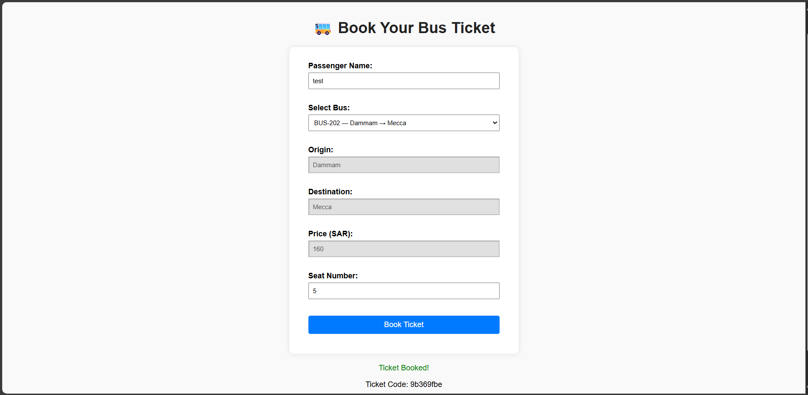
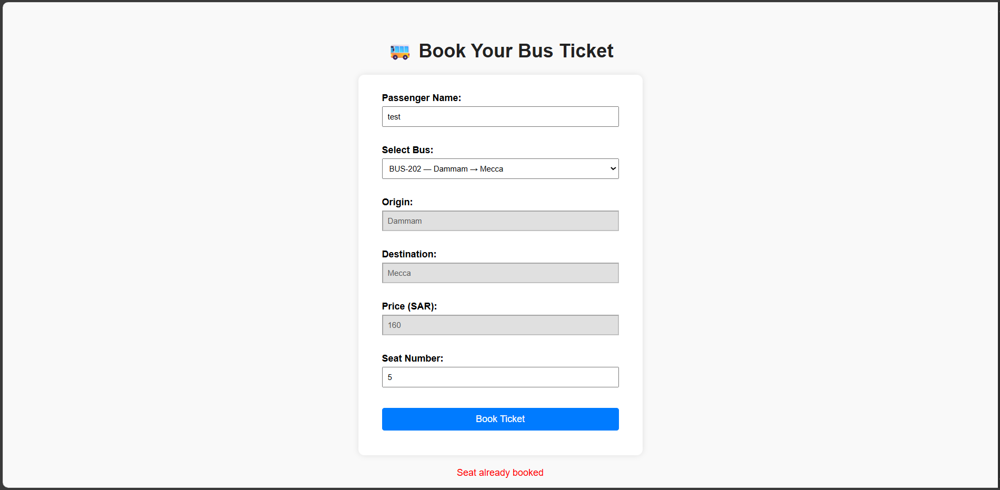

# 🚌 CloudBus - Online Bus Ticket Booking System

A FastAPI web application that allows users to book bus seats by selecting a bus, viewing details like price, origin, and destination, and choosing a seat number. Prevents duplicate bookings, gives dynamic feedback, and stores data in a local SQLite database.

Built as part of the **CodeAlpha Internship - Task 3**.

---

## 📌 Live Demo
🔗 [Visit the live site here](http://13.48.43.247)  

---

## ✨ Features

- Book tickets by selecting bus, seat, and passenger name.
- Select from multiple buses.
- Auto-filled fields for price, origin, and destination.
- Prevents double booking by checking seat availability.
- Dynamic success and error messages.
- Generates unique ticket code upon success.
- Fully responsive form.
- Simple, clean, and friendly UI.
- **Deployed using Docker on AWS EC2 instance**.

---

## 🛠️ Technologies Used

- **Python** 3.11
- **FastAPI** (Backend API)
- **SQLite** (Local Database)
- **HTML/CSS + JS** (Frontend)
- **Docker** (Containerization)
- **AWS EC2** (Cloud Deployment)

---

## 📁 Project Structure

```
CodeAlpha_CloudBusPass/
│
├── app/
│ ├── main.py # FastAPI app with route handling
│ ├── models.py # Database models
│ ├── schemas.py # Pydantic schemas
│ ├── crud.py # DB operations
│ ├── database.py # DB connection and setup
│ └── frontend/
│ ├── index.html # Main UI
│ ├── style.css # Styling
│ └── script.js # Form interactivity
│
├── assets/
│ ├── Screenshot1_bus.png
│ ├── Screenshot2_bus.png
│ └── Screenshot3_bus.png
│
├── buspass.db # SQLite database
├── Dockerfile # Docker configuration
├── requirements.txt # Project dependencies
└── README.md # Project documentation
```

---

## ✅ How It Works

1. User enters name and selects a bus from the dropdown.
2. Price, origin, and destination are auto-filled.
3. The user enters a seat number.
4. System checks availability if the seat is already booked or not, and stores data in the SQLite DB.
5. Displays a success or error message accordingly.

---

## 📷 UI Preview


- 🎫 **Initial View**  
  The user is greeted with a modern, clean UI to enter their name and select a bus, and the form auto-fills relevant trip information.
  


- ✅ **Successful Booking**  
  When booking is successful, a green success message confirms the reservation with ticket info.
  
  
- 🚫 **Seat Already Booked**  
  If the user tries to book a seat that’s already reserved, a red error message is displayed.
  


---

## 🚀 Deployment Notes

- The app is **containerized with Docker**.
- Deployed on an **AWS EC2 Ubuntu instance**.

---

## 🧑‍💻 Author
- Asma Alshilash
